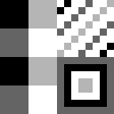

imgtogb
=======

**imgtogb** is a set of utilities for converting images into Game Boy sprites and tiles.
imgtogb currently consists of two tools: **igmtogbmap** and **imgtogbspr**.

During conversion the image is converted into four colors based on luminance. While not required it is recommended to use a monochrome image using colors `#000000`, `#555555`, `#aaaaaa` and `#ffffff` for best results.

The only output format currently supported is C headers for use with GBDK. Assembly files for RGBDS will be added very soon.

[stb_image](http://nothings.org/stb_image.c) is used for image reading so some images (such as indexed PNGs and progressive JPEGs) will not work.

## imgtogbmap ##

**imgtogbmap** is used for generating background and window tile maps. Identical tiles will automatically be detected
and removed to save space.

### Usage ###

    Usage: imgtogbmap [OPTIONS] IMAGE

    Options:
      -h            Print this help text.
      -n NAME       Name of tile map.
      -o FILENAME   Path to output file.
      -O OFFSET     Adds offset to tile map indices

    Output is written to STDOUT if no output file is given.

    If no NAME is given the basename of IMAGE is used.
    (e.g. "monster.png" will produce "monster_tiles" and "monster_data")

## imgtogbspr ##

**imgtogbspr** is used for generating sprite tile data. Both 8x8 and 8x16 sprites sizes are supported.

### Usage ###

    Usage: imgtogbspr [OPTIONS] IMAGE
    
    Options:
      -h            Print this help text.
      -n NAME       Name of output.
      -o FILENAME   Path to output file.
      -s SIZE       Sprite size. 8x8 or 8x16
    
    Output is written to STDOUT if no output file is given.
    
    If no NAME is given the basename of IMAGE is used.
    (e.g. "enemies.png" will produce "enemies_data")
    
Changing the sprite size with the `-s` flag changes the order the sprite tiles appear in sprite VRAM.

    8x8 mode    8x16 mode
    +---+---+   +---+---+
    | 0 | 1 |   | 0 | 2 |
    +---+---+   +---+---+
    | 2 | 3 |   | 1 | 3 |
    +---+---+   +---+---+

## Example usage ###

Running `imgtogbmap test.png -o test.h` on the above image (enlarged 800%) produces the following file

    #ifndef __test__
    #define __test__
    
    #define test_tiles_width 2
    #define test_tiles_height 2
    const unsigned char test_tiles[] = {
    	0x00, 0x01, 
    	0x00, 0x02, 
    };
    
    #define test_data_length 3
    const unsigned char test_data[] = {
    	0xff, 0xf0, 0xff, 0xf0, 0xff, 0xf0, 0xff, 0xf0, 0x00, 0xf0, 0x00, 0xf0, 0x00, 0xf0, 0x00, 0xf0, 
    	0x41, 0x48, 0x82, 0x90, 0x04, 0x20, 0x08, 0x41, 0x10, 0x82, 0x20, 0x04, 0x41, 0x09, 0x82, 0x12, 
    	0x00, 0xff, 0x7e, 0xff, 0x42, 0xc3, 0x5a, 0xc3, 0x5a, 0xc3, 0x42, 0xc3, 0x7e, 0xff, 0x00, 0xff, 
    };
    
    #endif
